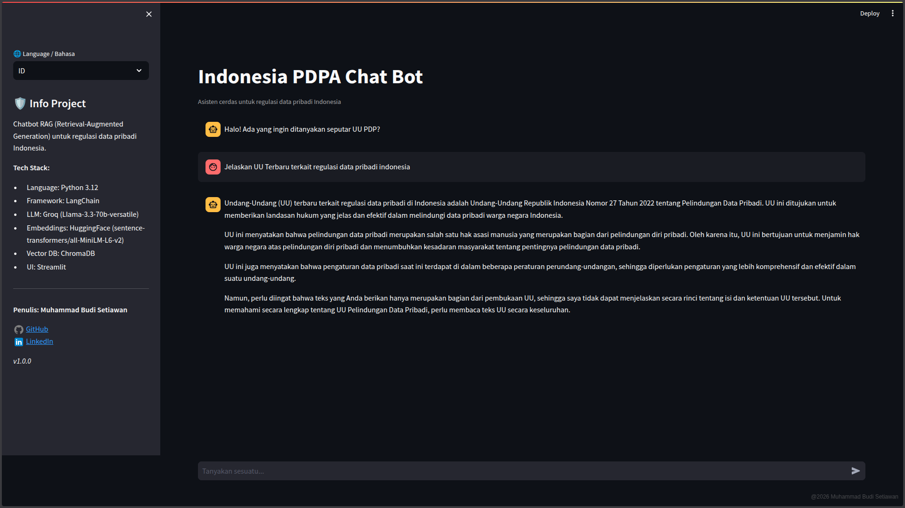

# PDPA Chatbot

Personal Data Protection Act Chatbot


## Background

Public awareness of personal data protection in Indonesia remains relatively low. Many people are still unaware of the boundaries and existing regulations related to this issue. This lack of understanding has led to several serious violations in the use of personal data. With the presence of this bot, it is expected to facilitate curious individuals and help increase awareness regarding personal data protection.

## Tech Stack

- **Language**: Python 3.12
- **Framework**: LangChain
- **LLM**: Groq (Llama-3.3-70b-versatile)
- **Embeddings**: HuggingFace (sentence-transformers/all-MiniLM-L6-v2)
- **Vector DB**: ChromaDB
- **UI**: Streamlit

## Installation

1. **Clone Repository**

```bash
git clone [https://github.com/username/pdpa-chatbot.git](https://github.com/username/pdpa-chatbot.git)
cd pdpa-chatbot
```

2. **Make Virtual Environment**

```bash
python3 -m venv .venv
source .venv/bin/activate  # Linux/macOS
# Or
.venv\Scripts\activate     # Windows
```

3. **Install Dependency**

```bash
pip install -r requirements.txt
```

4. **Environment Configuration**

Make file `.env` in root folder and insert API Key

```plaintext
GROQ_API_KEY=gsk_your_groq_api_key_here
```

## Getting Started

1. **Ingestion Data**

Put PDF regulation in `data` folder and run:

```bash
python3 main_ingest.py
```

2. **Run Chatbot**

```bash
python3 -m streamlit run src/streamlit/app.py
```

## Folder Structure

```plaintext
pdpa-chatbot/
├── .env
├── .gitignore
├── requirements.txt
├── README.md
├── data/
├── vector_db/
├── src/
│   ├── __init__.py
│   ├── ingestion/
│   │   ├── __init__.py
│   │   └── embedder.py
│   ├── brain/
│   │   ├── __init__.py
│   │   └── rag_chain.py
│   └── web/
│       ├── __init__.py
│       └── app.py
└── tests/
```
